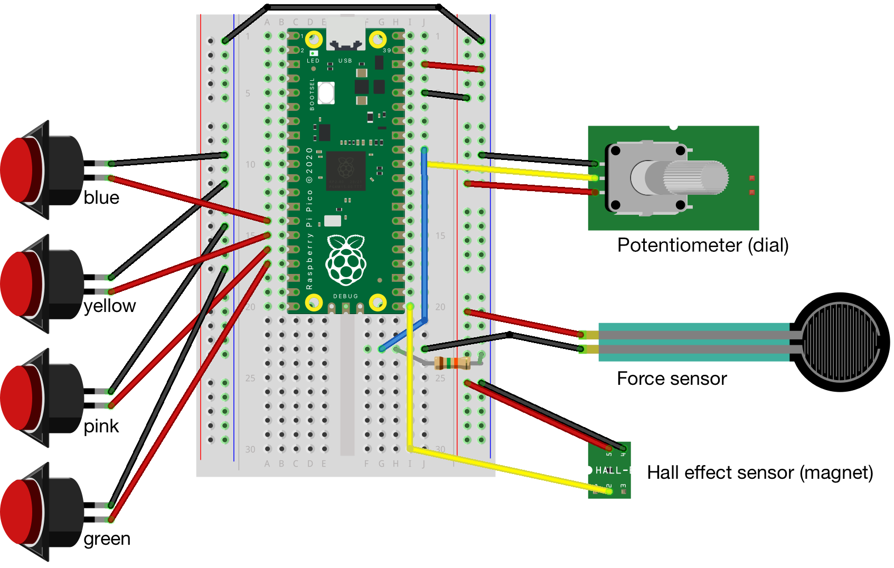

# KV6006 Practical Session - 4 - Putting it all together

At this point you have:

- Retrieved data from API endpoints, structured as JSON.
- Subscribed to sensor data feeds over MQTT, setting up a callback function to parse and handle new data when it arrives.
- Sent commands (formatted as JSON) over MQTT, to control a physical output device.

Broadly, you have inputs and outputs, and several fragments of Python which might help you glue those together.

## Your challenge

The sensor device is happily spewing data into the aether. It seems a shame not to do something with it. So:

> **Pick some inputs, and hook them up to some outputs.**

You might turn your servo into a pointer on a scale, indicating some received value. Or use the colour of your LED to indicate the state of something.

### Sensors

For reference, here's a diagram of the Pico sensor device with all the wires in the right places (which helps me if and when some of them fall out):



The JSON output looks something like:

```json
{
  "sensors": [
      { "name": "temperature", "value": 26.10811 },
      { "name": "magnet", "value": 1 },
      { "name": "dial", "value": 45931 },
      { "name": "force", "value": 688 },
      { "name": "blue", "value": 1 },
      { "name": "yellow", "value": 1 },
      { "name": "pink", "value": 1 },
      { "name": "green", "value": 1 }
  ]
}
```

As with the Mbed boards, `temperature` is taken from an on-chip sensor, so it's pretty hopeless as a room thermometer.

### Things that might be useful
#### Code

Most likely, you'll want to graft the configuration parts of `basic_send.py` into `mqtt_subscribe-parse.py`. That's because you probably want to publish commands to your output device from within the `on_message` callback function. Gluing everything together in Thonny on the Pis is a bit painful, so there's a starting point file in `examples/mqtt_send/control_device.py`. Copy this into your `student_work` directory and hack away on it.

#### Materials

Cardboard, scissors, tape and pens are available, if you'd like to get crafty.

#### Range

You may need to investigate the min/max range the sensors might output. How could you do that?

#### Converting scales

You'll very likely need to convert a number that lies between two limits into the corresponding number that lies between two different limits. For example, scaling hue angle from 0..360 to 0..255. This Python function might help:

```python
def rescale(x, in_min, in_max, out_min, out_max):
    """Rescale a value from one range to another."""
    return int((x - in_min) * (out_max - out_min) / (in_max - in_min) + out_min)
```

To scale a value `input` which lies between `0..360` to the corresponding value which lies between `0..255`:

```python
output = rescale(input, 0, 360, 0, 255)
```

Make sure both ranges are positive, and non-zero.

I've included this function in the `control_device.py` example script.
#### Things to discuss

- How does your program store state? Does it need to?
- You're working on a Raspberry Pi, which is orders of magnitude more powerful than the Pico W and ESP8266 devices. Do you need all that power to achieve what you're doing?
- The sensor device is a spiky mess of wires, but where might you encounter similar sorts of sensors 'in the real world'?
